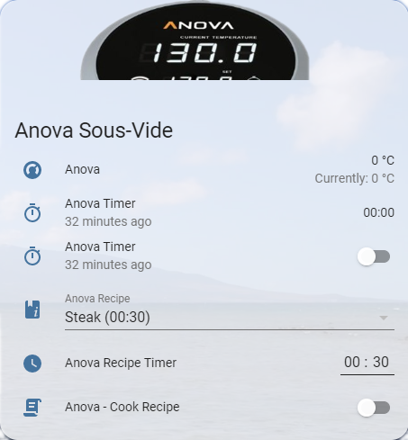

# AnovaMaster

AnovaMaster acts as a bridge between an Anova immersion sous vide device
and an MQTT bus. It broadcasts current status of the cooker on a given
MQTT channel, and receives commands to control the device.

It was written to integrate with [Home Assistant](https://home-assistant.io/)
using the [MQTT HVAC](https://home-assistant.io/components/climate.mqtt/)
component. But should work well with any other automation system.

## Requirements

* Any Bluetooth adapter supported by Linux should work. Tested
this running a Raspberry Pi Zero W, Raspberry Pi 3 and with a Bluetooth Dongle.

## Getting the MAC Address of your Anova:

1. Retrieve the Anova MAC Address using this command:
```
$ sudo hcitool lescan
LE Scan ...
F8:04:33:AF:AB:A2 [TV] UE48JU6580
34:03:8C:12:4C:57 Anova
[...]
```
1. Note down your `Anova` mac address - you will need to use this as part of your configuration...

## Setup & Configuration - Docker:

1. Supported platforms:
    1. linux/arm32v6
1. Open `docker-compose.yml` (see below) and edit the environment to suit your configuration... 
1. Stand up the container - `docker-compose up -d`

## docker-compose.yml:
```yaml
version: '3'
services:

  anova:
    image: lolouk44/anovamaster:latest
    container_name: anova
    restart: unless-stopped

    network_mode: host
    privileged: true

    environment:
    - ANOVA_MAC=00:00:00:00:00:00 # Mac address of your Anova
    - MQTT_HOST=127.0.0.1  # MQTT Server (defaults to 127.0.0.1)
    - MQTT_PREFIX=anova
    - MQTT_USERNAME=       # Username for MQTT server (comment out if not required)
    - MQTT_PASSWORD=       # Password for MQTT (comment out if not required)
    - MQTT_PORT=           # Defaults to 1883
    - MQTT_TIMEOUT=30      # Defaults to 60
    - LOGGING_LEVEL=DEBUG  # Defaults to INFO
    volumes:
      - /etc/localtime:/etc/localtime:ro # to get logs timetamp in local time instead of UTC
```

## Manual Installation (e.g. not using Docker)

* Check out the code and change in to the new directory.
* Install dependencies

        $ sudo apt-get install libglib2.0-dev virtualenv

* Create and activate a python virtual environment

        $ virtualenv venv
		$ . venv/bin/activate

* Install dependencies

		$ pip install -r requirements.txt

* Create a configuration file. Refer to comments in the config file for
  how to set it up.

		$ cp config/AnovaMaster.cfg.sample config/AnovaMaster.cfg
		$ nano config/AnovaMaster.cfg

* Run it.

		$ ./run.py

* Alternatively set it as a service:
  (`anova.service` may need to be edited to reflect correct paths)
```
sudo cp anova.service /lib/systemd/system/
sudo systemctl enable anova.service
sudo systemctl start anova.service
```


## Status packet

AnovaMaster broadcasts regular status messages to MQTT. The payload of these
is a JSON packet with the following format:

        {
		  "state": "running",
		  "current_temp": "140",
		  "target_temp": "140",
		  "temp_unit": "F"
	    }

### state

The state field will be one of

* "stopped"
* "running"
* "disconnected"

### Temperatures

Temperatures are represented as a string, accurate to one decimal place. The
`temp_unit` field will be one of

* "C"
* "F"

## Timer status packet

AnovaMaster broadcasts regular timer status messages to MQTT. The payload of these
is a JSON packet with the following format:

        {
		 "timer": "1440",
		 "timer_state": "running"
	    }

### timer_state

The state field will be one of

* "stopped"
* "running"

### timer

timer is the current value in minutes.

## Sending commands

AnovaMaster currently supports turning the Anova on/off, and setting the
temperature. Each can be done by sending a message with the topic as
configured in the config file.

### Setting state

The payload should be one of these strings

* "stopped" - turn the Anova off
* "running" - turn the Anova on

### Setting temperature

The payload should be a float. AnovaMaster will set it as the desired
temperature in whichever unit the Anova is currently set to. The
temperature must be inside these limits, otherwise it will be discarded:

|         | Celsius | Fahrenheit |
|---------|---------|------------|
| Maximum | 20      | 77         |
| Minimum | 99      | 210        |

### Setting timer

The payload should be an integer. AnovaMaster will set it as the desired timer

### Setting timer state

The payload should be one of these strings

* "stopped" - turn the timer off
* "running" - turn the timer on

## Integration with Home Assistant

In `configuration.yaml`, enter the below information. Be sure to update the MQTT topic if different than default `anova`:

```yaml
automation:
  - alias: Anova - Set Recipe Timer
    initial_state: true
    trigger:
      - platform: state
        entity_id:
          - input_select.anova_recipe
    action:
    - service: input_datetime.set_datetime
      entity_id: input_datetime.anova_timer
      data_template:
        time: '{{states("input_select.anova_recipe").split("(")[1].split(")")[0]}}:00'

climate:
  - platform: mqtt
    name: Anova
    modes:
      - "off"
      - heat
    qos: 1
    initial: 19
    current_temperature_topic: anova/status
    current_temperature_template: "{{ value_json.current_temp }}"
    temperature_state_topic: anova/status
    temperature_state_template: "{{ value_json.target_temp }}"
    mode_state_topic: anova/status
    mode_state_template: "{{ value_json.state }}"
    mode_command_topic: anova/command/run
    temperature_command_topic: anova/command/temp
    min_temp: 20
    max_temp: 99
    temp_step: 0.5

input_datetime:
  - anova_timer:
    name: Anova Recipe Timer
    has_date: false
    has_time: true

input_select:
  - anova_recipe:
    name: 'Anova Recipe'
    options:
      - "Egg - Soft Boiled (00:45)"
      - "Lamb Steak (03:00)"
      - "Pork Tenderloin (02:00)"
      - "Steak (00:30)"
      - "Tuna Steak (00:45)"
      - "Venison Steak (01:40)"
    icon: mdi:book-information-variant

script:
  - anova_cook_recipe:
    alias: Anova - Cook Recipe
    sequence:
      - service: climate.set_temperature
        data_template:
          entity_id: climate.anova
          temperature: >-
             63.3
             55
             57.2
             54
             43.3
             54
            
          hvac_mode: 'heat'
      - delay:
          seconds: 15
      - wait_template: "{{ is_state('climate.anova', 'heat') }}"
        timeout: '00:00:15'
      - service: mqtt.publish
        data:
          topic: anova/command/timer
          payload_template: '{{(states("input_select.anova_recipe").split("(")[1].split(")")[0].split(":")[0] | int * 60) + (
  states("input_select.anova_recipe").split("(")[1].split(")")[0].split(":")[1] | int)}}'
      - wait_template: '{{ state_attr("climate.anova","temperature") | int -  state_attr("climate.anova","current_temperature") | int < 1}}'
        timeout: '00:00:15'
      - service: switch.turn_on
        entity_id: switch.anova_timer

sensor:
  - platform: mqtt
    name: Anova
    state_topic: anova/timer
    value_template: "{{ (value_json.timer | int) }}"
    icon: 'mdi:timer'

switch:
  - platform: mqtt
    name: Anova Timer
    state_topic: anova/timer
    command_topic: anova/command/timer_run
    payload_on: heat
    payload_off: "off"
    state_on: heat
    state_off: "off"
    optimistic: false
    retain: true
    value_template: "{{ value_json.timer_state }}"
    icon: 'mdi:timer'
```

## Lovelace card

Save the `Anova.png` file in the `www` folder in your config directory. If the `www` folder does not exist, create it and restart Home-Assistant
Add the following to one of your views
```yaml
  - type: entities
    title: Anova Sous-Vide
    state_color: true
    show_header_toggle: false
    header:
      type: picture
      image: '/local/Anova.png'
    entities:
      - entity: climate.anova
      - entity: sensor.anova_timer
        secondary_info: last-changed
      - entity: switch.anova_timer
        secondary_info: last-changed
      - entity: input_select.anova_recipe
      - entity: input_datetime.anova_timer
      - entity: script.anova_cook_recipe
```

